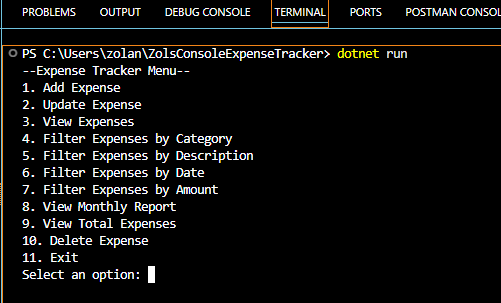
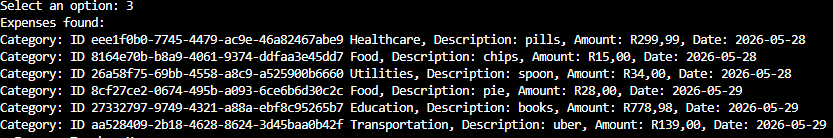
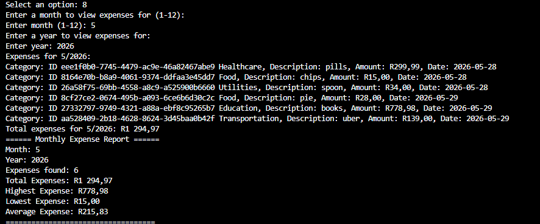

# Zols Console Expense Tracker

A console-based expense tracking application built with C# and .NET that allows users to track, analyze, and manage expenses through a clean console interface.

---

## Features

### Expense Management
- Add expenses
- View expenses
- Delete expenses
- Input validation
- JSON data persistence

### Categories
- Food
- Transportation
- Entertainment
- Utilities
- Other

### Analytics
- Calculate total expenses
- Highest expense reporting
- Lowest expense reporting
- Average expense reporting
- Expense count reporting
- Monthly expense totals
- Monthly expense reports

### Filtering & Search
- Filter by category
- Search by description
- Filter by date
- Filter by amount range

---

## Testing

This project includes automated unit testing using xUnit.

### Test Coverage
- Total expense calculations
- Average expense calculations
- Highest expense retrieval
- Lowest expense retrieval
- Category filtering
- Description filtering
- Date filtering
- Amount filtering
- Monthly report calculations

Current Status:

✅ 11 Passing Tests

---

## CI/CD

GitHub Actions automatically:

- Restores dependencies
- Builds the project
- Runs all unit tests
- Creates build artifacts

---

## Screenshots

### Main Menu



### Expense List



### Monthly Report



---

## Wireframes

### Initial Design


---

## Architecture

### Current Architecture

```text
Program
   │
   ▼
ExpenseManager
   │
   ├── Expense
   ├── Reports
   └── Filters
           │
           ▼
      JSON Storage
```

---

## Version Roadmap

```text
v1.0  Basic Expense Tracking
   │
   ▼
v1.1  JSON Persistence
   │
   ▼
v1.2  Categories
   │
   ▼
v1.3  Delete Expenses
   │
   ▼
v1.4  Filtering System
   │
   ▼
v1.5  Reporting Features
   │
   ▼
v1.6  Monthly Reports
   │
   ▼
v1.7  Unit Testing + CI/CD
   │
   ▼
v2.0  ASP.NET Web API
   │
   ▼
v3.0  Flutter Mobile App
   │
   ▼
v4.0  SAP + Azure Integration
```

---

## Technologies

- C#
- .NET 10
- xUnit
- JSON Persistence
- Git
- GitHub Actions
- VS Code

---

## Project Structure

```text
ZolsConsoleExpenseTracker
│
├── ExpenseInterface
│   ├── Models
│   ├── Services
│   └── Storage
│
├── ExpenseInterface.Tests
│
├── Data
│   └── expenses.json
│
└── .github
    └── workflows
```

---

## Future Improvements

### v2
- ASP.NET Core Web API
- Swagger Documentation
- Authentication

### v3
- Flutter Mobile Application
- Shared Backend API
- Mobile Reporting Dashboard

### v4
- Azure Deployment
- SAP Integration Suite
- Enterprise Reporting

---

## Author

Zolani Mjikeliso

Building toward:
- SAP Integration
- Azure Development
- Flutter Mobile Development
- Clean Architecture